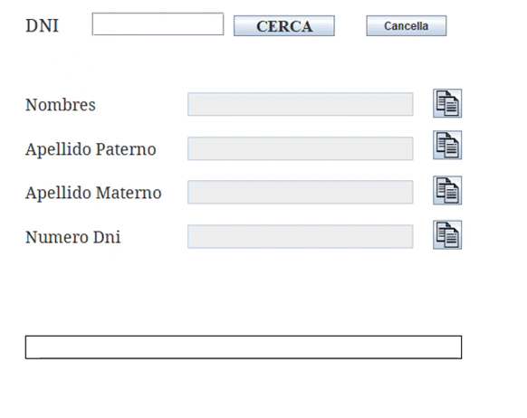

# Consulta DNI Java

  <!-- Cambia el path por la ubicación de tu GIF -->


Este es un pequeno programa hecho en Java que consulta el DNI y obtiene los nombres de las personas. La API utilizada es proporcionada por un tercero: [apiperu.dev](https://apiperu.dev/).

## Características

- Consulta información de una persona por su DNI.
- Muestra los nombres completos, apellido paterno y materno.
- Uso de una API externa para obtener los datos.

## Requisitos

- Java 8 o superior
- Maven

## Instalación

1. Clona este repositorio:

    ```sh
    git clone https://github.com/tu-usuario/tu-repositorio.git
    cd tu-repositorio
    ```

2. Configura las variables de entorno:

    Crea un archivo `.env` en el directorio raíz del proyecto con el siguiente contenido:

    ```plaintext
    # Token de la API
    API_TOKEN=your_bearer_token_here
    ```

3. Construye el proyecto con Maven:

    ```sh
    mvn clean install
    ```

## Ejecución

1. Ejecuta el proyecto:

    ```sh
    mvn exec:java -Dexec.mainClass="com.brayan.testapi.Launcher"
    ```

2. Sigue las instrucciones en la interfaz gráfica para ingresar el DNI y consultar la información.

## Uso

1. Ingresa un DNI de 8 dígitos en el campo correspondiente.
2. Haz clic en el botón "Consultar".
3. La información de la persona será mostrada en el área de resultados.

## Contribuciones

Las contribuciones son bienvenidas. Siéntete libre de abrir un `issue` o enviar un `pull request`.

## Licencia

Este proyecto está bajo la Licencia MIT. Para más detalles, consulta el archivo [LICENSE](./LICENSE).

